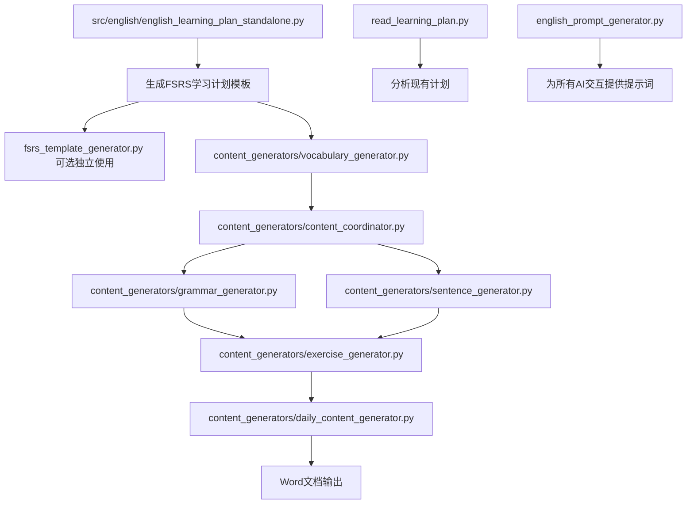

# 英语学习系统

## 项目概述

这是一个完整的英语学习系统，采用模块化设计和AI增强技术，提供智能化的学习计划生成、内容验证和文档输出功能。系统基于新的架构模式，集成了统一的服务层和AI框架，具备完整的验证框架和通用学习框架。

## 主要功能

### 1. 智能学习计划生成
- **AI增强内容生成**：使用大语言模型生成自然有意义的句子和练习题
- **多模型支持**：集成Zhipu、DeepSeek、OpenAI等多种AI模型
- **智能模型路由**：根据场景自动选择最适合的AI模型
- **FSRS记忆算法**：基于最新遗忘曲线算法优化复习安排

### 2. 学习计划管理
- **计划生命周期管理**：创建、保存、列出、选择、删除计划
- **多格式输出**：支持控制台显示和Word文档输出
- **自定义计划**：用户指定计划时长、每日学习时间，系统自动规划
- **阶段化学习**：支持6个学习阶段，从基础到高级

### 3. 内容验证系统
- **智能验证框架**：自动验证句子和练习题的语法正确性
- **质量评估**：评估内容难度、针对性和教育价值
- **自动优化**：提供改进建议和自动修正功能

### 4. 新架构服务层
- **服务工厂模式**：统一的服务创建和管理
- **依赖注入**：松耦合的模块设计
- **事件驱动**：基于事件的系统架构
- **配置管理**：统一的配置管理系统

## 快速开始

### 1. 环境准备

```bash
# 安装依赖
pip install zhipuai python-docx psutil

# 配置智谱API密钥（可选，不配置则使用模板模式）
# 编辑 src/educational_projects/shared/infrastructure/config/ai_models.json
```

### 2. 基础使用

#### 交互式学习计划创建（推荐）
```bash
# 启动交互式总入口
python src/english/core/plan_creator.py

# 按提示操作：
# 1. 选择学习阶段
# 2. 设置学习周期（天数）
# 3. 设置每日学习时间
# 4. 系统自动生成AI学习计划
# 6. 选择是否立即生成学习内容
```

#### 命令行模式（高级用户）
```bash
# 直接运行新的学习计划生成器
python src/english/core/plan_creator.py
```

### 3. 高级功能

#### 学习计划管理
```bash
# 使用新的学习计划生成器
python src/english/core/plan_creator.py
```

#### 自定义学习计划生成器
```bash
# 使用新的学习计划生成器
python src/english/core/plan_creator.py
```

## 学习阶段说明

| 阶段 | 内容比例 | 适合人群 | 学习目标 |
|------|----------|----------|----------|
| **beginner** | 100%小学内容 | 零基础学习者 | 掌握基础词汇500-800个，学会基本语法结构 |
| **intermediate** | 50%小学+50%初中 | 有一定基础的学习者 | 平衡发展，巩固基础，提升能力 |
| **advanced** | 100%初中内容 | 基础较好的学习者 | 掌握高级语法，扩大词汇量 |
| **comprehensive** | 40%小学+60%初中 | 全面复习的学习者 | 综合复习，查漏补缺 |

## 学习模式说明

| 每日时间 | 学习模式 | 特点 | 适用场景 |
|----------|----------|------|----------|
| **≥50分钟** | 强化学习 | 高强度，快速提升 | 假期集中学习 |
| **25-49分钟** | 标准学习 | 平衡发展，稳步提升 | 日常学习 |
| **<25分钟** | 轻松学习 | 轻松愉快，保持兴趣 | 忙碌时期 |

## 技术架构

### 1. 新架构模式
- **服务层架构**：统一的业务逻辑服务
- **依赖注入**：松耦合的模块设计
- **事件驱动**：基于事件的系统架构
- **配置管理**：统一的配置管理系统

### 2. AI模型集成
- **多模型支持**：Zhipu、DeepSeek、OpenAI等
- **智能路由**：根据场景自动选择最适合的模型
- **配置管理**：灵活的模型配置和切换
- **统一接口**：标准化的AI客户端接口

### 3. 验证框架
- **内容验证**：自动验证句子和练习题的语法正确性
- **质量评估**：评估内容难度、针对性和教育价值
- **自动优化**：提供改进建议和自动修正

### 4. 通用学习框架
- **模块化设计**：验证器、生成器、文档生成器独立模块
- **多学科支持**：框架设计支持扩展到其他学科
- **配置驱动**：通过配置文件灵活调整学习参数

## 脚本功能说明

### 主要脚本

#### 1. 核心学习计划脚本

| 脚本名称 | 功能描述 | 使用场景 | 输出结果 |
|---------|---------|---------|---------|
| `english_learning_plan_standalone.py` | **主入口脚本**，FSRS算法学习计划生成器 | 创建新的学习计划，设置学习参数 | FSRS模板、标准格式JSON |
| `fsrs_template_generator.py` | 独立的FSRS模板生成工具 | 单独生成FSRS模板，无需完整流程 | FSRS学习模板JSON |

> **注意**: 这两个脚本位于项目根目录 (`/Users/fengxiao/project/education/`)，其他脚本位于 `src/english/` 目录下。

#### 2. 内容生成脚本

| 脚本名称 | 功能描述 | 依赖关系 | 输出结果 |
|---------|---------|---------|---------|
| `learning_content_generator.py` | **学习内容生成主入口**，统一管理各种内容生成 | 基础框架，被其他脚本调用 | 各类学习内容 |
| `content_generators/vocabulary_generator.py` | 每日单词学习内容生成器，基于FSRS算法 | 需要已有学习计划 | 每日单词列表、学习进度 |
| `content_generators/exercise_generator.py` | 练习题生成器，支持多种题型 | 依赖词汇、词法、句法内容 | AI生成的练习题 |
| `content_generators/sentence_generator.py` | 练习句子生成器，结合词汇和语法 | 需要词汇和语法配置 | 语境化练习句子 |
| `content_generators/grammar_generator.py` | 语法内容生成器（合并词法+句法） | 依赖语法配置文件 | 语法学习内容 |
| `content_generators/daily_content_generator.py` | 学习文档生成器，输出Word文档 | 需要完整的学习内容 | 格式化的Word文档 |

#### 3. 工具和服务脚本

| 脚本名称 | 功能描述 | 主要用途 | 特点 |
|---------|---------|---------|-----|
| `read_learning_plan.py` | 学习计划读取器和分析工具 | 查看已生成的学习计划，分析学习进度 | 只读操作，不修改数据 |
| `english_prompt_generator.py` | AI提示词生成器 | 为AI模型生成专业的提示词 | 核心AI交互组件 |

### 脚本工作流程



### 使用建议

#### 🚀 快速开始（推荐路径）
```bash
# 1. 生成学习计划（一站式）
python src/english/core/plan_creator.py

# 2. 查看生成的计划
python read_learning_plan.py
```

#### 🔧 高级使用（分步骤）
```bash
# 1. 单独生成FSRS模板
python src/english/core/fsrs_generator.py

# 2. 生成每日词汇内容
python src/english/content_generators/vocabulary_generator.py

# 3. 生成练习题
python src/english/content_generators/exercise_generator.py

# 4. 生成学习文档
python src/english/content_generators/daily_content_generator.py
```

#### 📊 内容管理
```bash
# 查看和分析学习计划
python read_learning_plan.py

# 生成特定类型内容
python src/english/content_generators/grammar_generator.py  # 词法内容
python src/english/content_generators/grammar_generator.py      # 句法内容
python src/english/content_generators/sentence_generator.py  # 练习句子
```

## 项目结构

```text
src/english/
├── # === 核心功能模块 ===
├── core/                               # 🎯 核心功能
│   ├── plan_creator.py                 # 🚀 学习计划创建器
│   ├── plan_manager.py                 # 🗂️  学习计划管理器
│   └── fsrs_generator.py               # 🛠️  FSRS模板生成器
├── 
├── # === 内容生成器模块 ===
├── content_generators/                 # 📝 内容生成器
│   ├── content_coordinator.py          # 📚 内容生成协调器
│   ├── vocabulary_generator.py         # 📅 词汇内容生成器
│   ├── grammar_generator.py            # 🔤 语法内容生成器（词法+句法）
│   ├── exercise_generator.py           # 📝 练习题生成器
│   ├── sentence_generator.py           # 💬 练习句子生成器
│   └── daily_content_generator.py      # 📄 日常学习文档生成器
├── 
├── # === 工具模块 ===
├── utils/                              # 🛠️ 工具模块
│   ├── prompt_generator.py             # 🤖 AI提示词生成器
│   └── plan_reader.py                  # 👀 学习计划读取器
├──
├── # === 服务层 ===
├── services/                           # 业务逻辑服务
│   ├── morphology_service.py           # 词法服务
│   ├── syntax_service.py               # 句法服务
│   ├── simple_word_service.py          # 简化单词服务
│   ├── vocab_selector.py               # 词汇选择器
│   └── fsrs_learning_generator.py      # FSRS学习生成器
├──
├── # === 功能模块 ===
├── adapters/                           # 适配器层
│   └── ai_client_adapter.py            # AI客户端适配器
├── validators/                         # 内容验证器
│   ├── english_exercise_validator.py   # 英语练习题验证器
│   └── english_sentence_validator.py   # 英语句子验证器
├── generators/                         # 内容生成器
│   ├── english_exercise_generator.py   # 英语练习题生成器
│   └── english_document_generator.py   # 英语文档生成器
├──
├── # === 配置和数据 ===
├── config/                             # 配置文件
│   ├── word_configs/                   # 单词配置
│   │   ├── 小学英语单词.json           # 小学单词（710个）
│   │   ├── 初中英语单词.json           # 初中单词（2292个）
│   │   ├── 高中英语单词.json           # 高中单词
│   │   └── classified_by_pos/          # 按词性分类的单词
│   ├── morphology_configs/             # 词法配置
│   │   ├── 小学词法.json
│   │   ├── 初中词法.json
│   │   └── 高中词法.json
│   ├── grammar_configs/                # 语法配置
│   │   ├── 小学句法.json
│   │   ├── 初中句法.json
│   │   └── 高中句法.json
│   └── stage.md                        # 学习阶段定义
├── docs/                               # 文档目录
└── README.md                           # 项目说明文档
```

## 共享框架

### 1. AI模型框架 (`shared/ai_framework/`)
- **多模型支持**：统一的AI模型接口
- **智能路由**：根据场景自动选择模型
- **配置管理**：灵活的模型配置
- **客户端适配**：标准化的AI客户端

### 2. 学习框架 (`shared/learning_framework/`)
- **记忆管理**：FSRS记忆调度算法
- **内容生成**：AI增强的内容生成
- **验证系统**：内容质量验证
- **组件管理**：AI组件统一管理

### 3. 基础设施框架 (`shared/infrastructure/`)
- **依赖注入**：IoC容器和依赖管理
- **事件系统**：事件总线和处理器
- **配置管理**：统一配置系统
- **监控系统**：健康检查和指标收集
- **缓存管理**：多级缓存系统
- **安全系统**：加密和输入验证

## 配置说明

### AI模型配置
配置文件位置：`src/educational_projects/shared/infrastructure/config/ai_models.json`

```json
{
  "llm_config": {
    "default_provider": "zhipu",
    "default_model": "glm-4.5-turbo",
    "timeout": 60,
    "max_retries": 3
  },
  "providers": {
    "zhipu": {
      "name": "智谱AI",
      "api_key": "your_api_key_here",
      "enabled": true,
      "models": {
        "glm-4.5-turbo": {
          "name": "glm-4.5-turbo",
          "max_tokens": 8192,
          "cost_per_token": 0.0008
        }
      }
    }
  }
}
```

## 输出文档

### Word文档格式
- **专业排版**：使用Word格式，支持专业排版
- **完整内容**：包含单词列表、练习题、学习计划等
- **分离答案**：练习题和答案分别生成文档
- **优化布局**：紧凑排版，节省纸张

### 文档内容
1. **学习内容概览**：阶段信息、单词统计、语法主题
2. **今日单词**：单词列表、音标、词性、中文释义
3. **今日语法**：语法主题、级别、学习重点
4. **综合句子**：结合单词和语法的实用句子（AI生成）
5. **练习题**：填空、翻译、选择题、句子完成等多种题型（AI生成）
6. **练习题答案**：所有练习题的答案和详细解释（单独一页）

## 学习策略

### 1. AI增强学习
- 使用大语言模型生成自然有意义的句子
- 智能生成符合语境的练习题
- 自动验证内容质量和教育价值

### 2. 滚动式记忆
- 按照FSRS遗忘曲线算法安排复习
- 智能调整复习间隔和强度
- 个性化记忆优化

### 3. 单词与语法结合
- 每个单词都生成包含相应语法的句子
- 在语境中学习单词，加深理解
- 通过语法规则巩固单词记忆

### 4. 多感官学习
- 视觉：看单词和句子
- 听觉：读出发音
- 触觉：手写练习
- 口语：大声朗读

## 常见问题

### Q: 如何选择合适的计划？
A: 根据您的英语基础选择学习阶段：
- 零基础：选择 beginner 阶段
- 有基础：选择 intermediate 阶段
- 基础较好：选择 advanced 阶段
- 全面复习：选择 comprehensive 阶段

### Q: AI生成的内容质量如何保证？
A: 系统采用多层验证机制：
- 语法正确性验证
- 内容质量评估
- 教育价值检查
- 自动优化建议

### Q: 如何查看学习进度？
A: 使用 `python src/english/core/plan_creator.py` 生成学习计划，系统会自动显示统计信息。

### Q: 生成的Word文档在哪里？
A: Word文档默认保存在统一的输出目录 `outputs/english/` 下，文件名包含日期和天数信息。

### Q: 如何备份学习计划？
A: 学习计划会自动保存为JSON格式，可在 `outputs/english/` 目录下找到。

### Q: 系统支持哪些AI模型？
A: 目前支持Zhipu、DeepSeek、OpenAI等多种模型，可通过配置文件灵活切换。

### Q: 新架构有什么优势？
A: 新架构提供：
- 更好的模块化和可维护性
- 统一的配置管理
- 松耦合的组件设计
- 事件驱动的系统架构
- 更好的测试和扩展性

## 脚本使用示例

### 场景1：完整学习计划创建（推荐新手）

```bash
# 第一步：创建FSRS学习计划
python src/english/core/plan_creator.py
# 交互式选择：
# - 学习阶段：第三阶段：能力构建 (初中低年级)
# - 学习周期：30天
# - 每日学习时间：45分钟
# - 效率参数：使用默认值

# 第二步：查看生成的学习计划
python read_learning_plan.py
# 功能：显示计划详情、学习进度、统计信息
```

### 场景2：分步骤内容生成（高级用户）

```bash
# 第一步：独立生成FSRS模板（可选）
python src/english/core/fsrs_generator.py
# 输出：FSRS模板JSON文件

# 第二步：生成每日单词内容
python src/english/content_generators/vocabulary_generator.py
# 基于FSRS算法计算每日应学习的单词
# 输出：按天分组的单词列表

# 第三步：生成词法和句法内容
python src/english/content_generators/grammar_generator.py  # 词法内容
python src/english/content_generators/grammar_generator.py      # 句法内容

# 第四步：生成练习句子
python src/english/content_generators/sentence_generator.py
# 结合当日单词和语法生成练习句子

# 第五步：生成练习题
python src/english/content_generators/exercise_generator.py
# 基于单词、词法、句法生成多种题型

# 第六步：生成Word学习文档
python src/english/content_generators/daily_content_generator.py
# 输出：完整的学习文档（Word格式）
```

### 场景3：内容分析和管理

```bash
# 分析现有学习计划
python read_learning_plan.py
# 功能：
# - 列出所有可用的学习计划
# - 显示计划详细信息
# - 统计词汇分布
# - 分析学习进度

# 查看计划的结构化输出
python read_learning_plan.py --format json  # JSON格式输出
python read_learning_plan.py --format table # 表格格式输出
```

### 场景4：自定义内容生成

```bash
# 1. 针对特定词性生成内容
python src/english/content_generators/vocabulary_generator.py --pos noun,verb
# 只生成名词和动词相关内容

# 2. 生成特定难度的练习题
python src/english/content_generators/exercise_generator.py --difficulty intermediate
# 生成中等难度的练习题

# 3. 自定义练习句子数量
python src/english/content_generators/sentence_generator.py --count 20
# 生成20个练习句子
```

### 脚本参数说明

#### english_learning_plan_standalone.py
```bash
# 交互模式（默认）
python src/english/core/plan_creator.py

# 命令行模式
python src/english/core/plan_creator.py \
  --stage "第三阶段：能力构建 (初中低年级)" \
  --days 30 \
  --minutes 45 \
  --learning-efficiency 1.0 \
  --review-efficiency 0.6
```

#### generate_daily_words.py
```bash
# 基础使用
python src/english/content_generators/vocabulary_generator.py

# 指定学习计划文件
python src/english/content_generators/vocabulary_generator.py --plan-file path/to/plan.json

# 生成特定天数的内容
python src/english/content_generators/vocabulary_generator.py --days 1-7

# 指定词性过滤
python src/english/content_generators/vocabulary_generator.py --pos noun,verb,adjective
```

#### generate_practice_exercises.py
```bash
# 默认生成所有题型
python src/english/content_generators/exercise_generator.py

# 指定题型
python src/english/content_generators/exercise_generator.py --types "填空,翻译,选择"

# 指定难度级别
python src/english/content_generators/exercise_generator.py --difficulty beginner

# 自定义题目数量
python src/english/content_generators/exercise_generator.py --count 15
```

### 最佳实践

#### 1. 新用户推荐流程
```bash
# 第一次使用
python src/english/core/plan_creator.py  # 创建计划
python read_learning_plan.py                # 查看计划
python src/english/content_generators/vocabulary_generator.py              # 开始学习
```

#### 2. 日常学习流程
```bash
# 每日学习流程
python src/english/content_generators/vocabulary_generator.py              # 获取今日单词
python src/english/content_generators/exercise_generator.py       # 生成练习题
python src/english/content_generators/daily_content_generator.py  # 生成学习文档
```

#### 3. 高级定制流程
```bash
# 完全自定义的学习内容生成
python src/english/core/fsrs_generator.py           # 自定义FSRS参数
python src/english/content_generators/grammar_generator.py       # 定制词法内容
python src/english/content_generators/grammar_generator.py           # 定制句法内容
python src/english/content_generators/sentence_generator.py       # 定制练习句子
python src/english/content_generators/exercise_generator.py       # 定制练习题
python src/english/content_generators/daily_content_generator.py  # 生成最终文档
```

#### 4. 错误排查
```bash
# 检查学习计划是否正确
python read_learning_plan.py --validate

# 详细日志输出
python src/english/core/plan_creator.py --verbose

# 测试AI连接
python english_prompt_generator.py --test-connection
```

## Services层服务文档

### 服务概览

Services层提供了英语学习系统的核心业务逻辑服务，采用简化架构。

#### 1. 词法服务 (MorphologyService)

**功能**: 管理英语词法点数据

**主要方法**:
- `get_morphology_count(stage: str) -> int`: 获取指定阶段的词法点数量
- `get_morphology_points(stage: str) -> List[MorphologyPoint]`: 获取词法点列表
- `get_morphology_by_category(stage: str, category: str) -> List[MorphologyPoint]`: 根据分类获取词法点
- `get_morphology_statistics() -> Dict[str, int]`: 获取词法统计信息
- `search_morphology(stage: str, keyword: str) -> List[MorphologyPoint]`: 搜索词法点
- `get_all_morphology_by_stage() -> Dict[str, List[MorphologyPoint]]`: 获取所有学习阶段的词法点列表
- `get_detailed_morphology_statistics() -> Dict[str, Any]`: 获取详细的词法统计信息（按阶段和类别）

**数据类**:
- `MorphologyPoint`: 词法点信息（ID、名称、分类、描述、例句、难度、阶段）

#### 2. 句法服务 (SyntaxService)

**功能**: 管理英语句法点数据

**主要方法**:
- `get_syntax_count(stage: str) -> int`: 获取指定阶段的句法点数量
- `get_syntax_points(stage: str) -> List[SyntaxPoint]`: 获取句法点列表
- `get_syntax_by_category(stage: str, category: str) -> List[SyntaxPoint]`: 根据分类获取句法点
- `get_syntax_statistics() -> Dict[str, int]`: 获取句法统计信息
- `search_syntax(stage: str, keyword: str) -> List[SyntaxPoint]`: 搜索句法点
- `get_all_syntax_by_stage() -> Dict[str, List[SyntaxPoint]]`: 获取所有学习阶段的句法点列表
- `get_detailed_syntax_statistics() -> Dict[str, Any]`: 获取详细的句法统计信息（按阶段和类别）

**数据类**:
- `SyntaxPoint`: 句法点信息（ID、名称、分类、描述、例句、难度、阶段）

#### 3. 简化单词服务 (SimpleWordService)

**功能**: 提供学习资源统计功能，不依赖复杂的infrastructure

**主要方法**:
- `get_learning_resource_statistics() -> Dict`: 获取学习资源统计信息（词汇、词法、句法）

**特点**:
- 轻量级实现，无复杂依赖
- 专注于统计功能
- 支持词汇、词法、句法的统一统计

### 使用示例

```python
from src.english.services import (
    MorphologyService,
    SyntaxService,
    SimpleWordService
)

# 获取服务实例
morphology_service = MorphologyService()
syntax_service = SyntaxService()
word_service = SimpleWordService()

# 使用词法服务
morphology_count = morphology_service.get_morphology_count("小学")
morphology_points = morphology_service.get_morphology_points("小学")
all_morphology = morphology_service.get_all_morphology_by_stage()  # 获取所有阶段的词法点
detailed_morphology_stats = morphology_service.get_detailed_morphology_statistics()  # 详细统计

# 使用句法服务
syntax_count = syntax_service.get_syntax_count("小学")
syntax_points = syntax_service.get_syntax_points("小学")
all_syntax = syntax_service.get_all_syntax_by_stage()  # 获取所有阶段的句法点
detailed_syntax_stats = syntax_service.get_detailed_syntax_statistics()  # 详细统计

# 使用简化单词服务
word_stats = word_service.get_learning_resource_statistics()
```

### 配置说明

所有服务都支持通过配置文件进行定制：

- **词法数据**: `src/english/config/morphology_configs/`
- **句法数据**: `src/english/config/grammar_configs/`
- **学习阶段**: `src/english/config/stage.md`

## 技术支持

如有问题或建议，请查看：
1. 本README文档的详细说明
2. 各脚本的 `--help` 参数
3. 系统生成的错误信息
4. 共享框架的文档说明

---

**祝您学习愉快！** 🎓📚✨